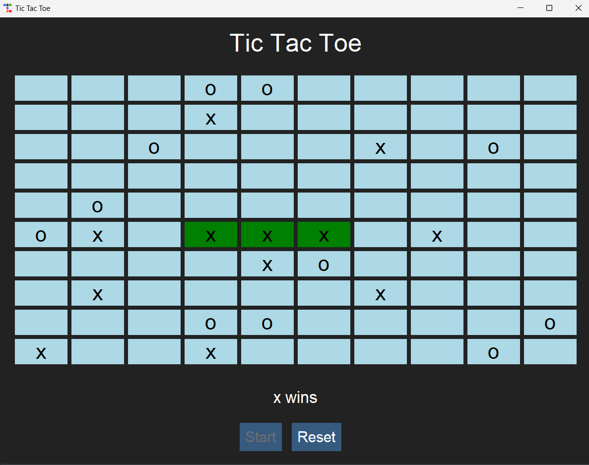

# Tic Tac Toe - Multithreaded Game

## Project Description

This project is an implementation of the popular game "Tic Tac Toe", leveraging the concepts of multithreading. The game involves a competition between two computer-controlled players who place their marks (cross or circle) on an expanded 10x10 board. The player who first places three of their marks in a line (horizontally, vertically, or diagonally) wins.


*Graphical User Interface of the game*


## How to Run the Game

1. Navigate to the `TicTacToe` folder in your terminal.
2. Run the game with this command:
`python ./source/gui.py`
3. Once the application has launched, click on the `Start` button to begin the game.


Remember to ensure that your python environment is set up correctly and all necessary dependencies are installed for the script to run.


## Threads Usage

We use two threads in the project, representing the individual players. Each player is represented by a thread that calls the `computer` method. This method simulates the computer's move, where it randomly selects a field on the board and places its mark.

```python
player1 = threading.Thread(target=self.game.computer, args=('x',))
player2 = threading.Thread(target=self.game.computer, args=('o',))
```

Each thread operates on a "queue" basis - player 1 (thread `player1`) starts first, followed by player 2 (thread `player2`). Each thread is secured by the `join()` operation, which ensures that the thread is executed to completion before the next thread starts. This cycle continues until one of the players wins or there is a tie.

## The `computer` Method

The `computer` method represents a player's move in the game. It selects a random field on the board for a move. If the field is unoccupied, it places its mark there. If this move results in a win, the `win_event` flag is set.

```python
def computer(self, player):
   while not self.win_event.is_set():
       self.player_turn = player
       move = random.randint(0, 99)
       if self.board[move] is None:
           self.board[move] = player
           if self.check_win():
               self.win_event.set()
           break
```
